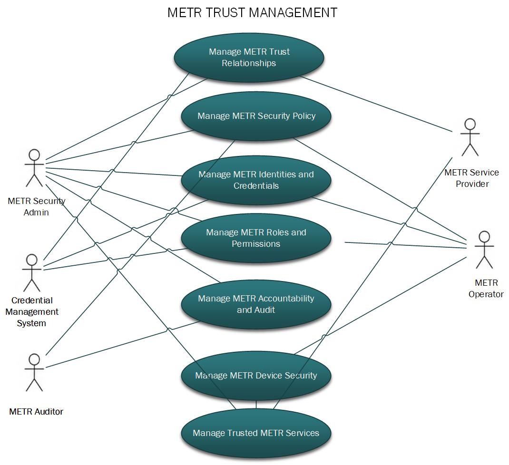

# Cybersecurity Use Cases

## METR Cyber Security Use Cases

METR cybersecurity use cases describe how security capabilities are applied across the METR lifecycle to establish and maintain trusted METR operations. The use cases are organized into three groups: preparation of the trusted METR environment, protection of trusted METR operations, and ongoing monitoring of METR security.

**METR Trust Management:** use cases establish the security foundation required before METR systems begin trusted operational exchanges. These use cases define and maintain the trust relationships, security policies, identities and credentials, authorization rules, audit requirements, and secure service registrations that allow METR participants to authenticate one another, make consistent authorization and trust decisions, protect security-relevant activity, and operate within a common security framework.

**METR Trusted Operations:** use cases describe the security activities performed while METR information is created, approved, transformed, distributed, received, and used. These use cases apply the trust, identity, authorization, cryptographic, provenance, non-repudiation, and secure transport capabilities established during domain preparation to individual METR transactions and information objects.

**METR Security Management**: use cases provide the ongoing security oversight needed to determine whether trusted METR operations continue to function as intended. These use cases include monitoring service availability and security-relevant activity, detecting disruptions or anomalous conditions, maintaining and reviewing audit information, preserving evidence, supporting discrepancy handling, and performing forensic analysis when needed.

### METR Trust Management Use Cases

Trusted METR domain preparation use cases define the security activities required to establish a METR environment in which trusted operations can occur. They address the establishment and maintenance of trust relationships, security policy, identities and credentials, authorization privileges and scopes, security audit requirements, and secure METR services. Figure X illustrates the principal actors and use cases involved in preparing the METR domain for trusted operation. The subsections that follow define each of these security use cases and identify the security controls applied to support them.

#### Manage METR Trust Relationships

This use case describes the activities required to establish and maintain the trust framework used by a METR domain. Before trusted METR operations begin, the responsible METR authority shall identify the external or internal trust services on which the METR deployment will rely and determine that those services provide an appropriate level of assurance for their intended use.

For each trust service, the METR authority shall evaluate the applicable governing policies, practices, trust model, security requirements, and operating procedures. This may include certificate policies and certification practice statements for credential services, as well as equivalent policy and assurance documentation for other identity, authentication, authorization, or trust services. The METR deployment shall be configured and operated in accordance with the applicable requirements of those documents and the METR security policy.

Where a METR domain relies on an external trust service, the METR authority shall establish the organizational, contractual, or other trust relationship necessary to use that service and shall define the respective responsibilities of the METR domain and service provider.

The METR authority shall configure the trust information necessary for METR components to rely on approved trust services. Depending on the trust mechanism, this may include trust anchors, trusted issuers, trusted service identities, verification keys, service endpoints, policy identifiers, or other trust configuration. Processes shall be established for the authorized installation, distribution, update, replacement, and removal of this trust information.

The output of this use case is an established and maintained METR trust framework identifying the approved trust services and relationships, their governing policies and practices, the trust information required by METR components, and the processes necessary to maintain those relationships throughout METR operation.

